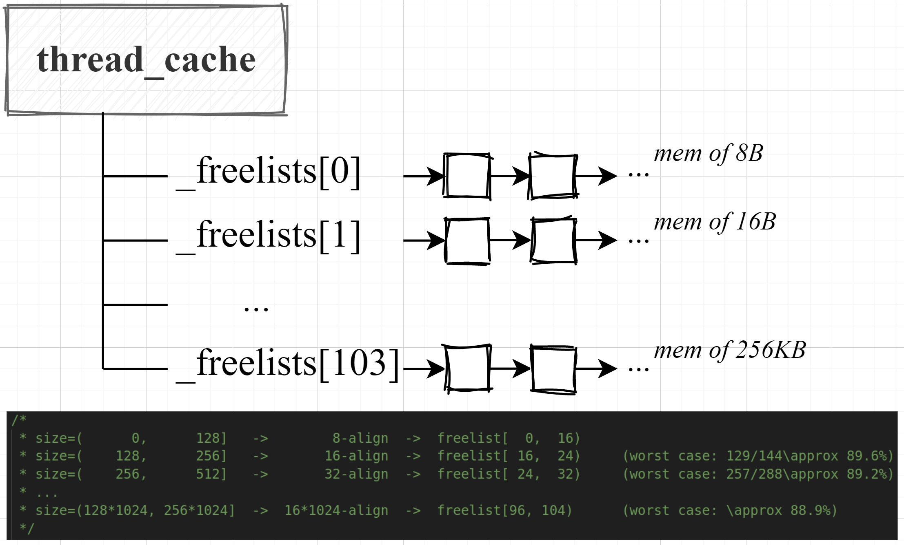
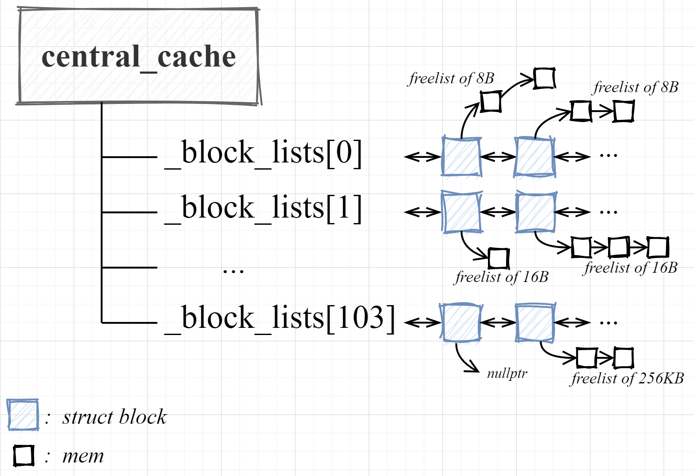
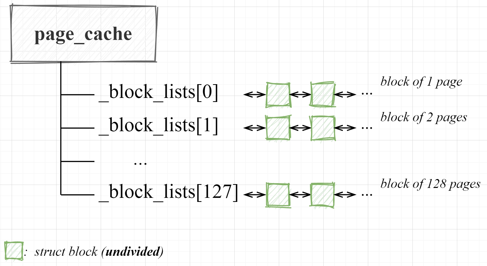

## tbmalloc (high-concurrency memory pool)

### Tricks
* The memory pool is divided into three layers: `thread_cache`, `central_cache` and `page_cache`.
* `thread_cache` is private for each thread. It maintains the array of linked lists (`_freelists[104]`), where each linked list is responsible for memory of the same size. 
  
  

* `central_cache` is public and unique. It maintains the array of doubly circular linked lists (`_blocklists[104]`), but each linked list is responsible for several blocks. The `struct block` manages large block of memory in page units. The `_freelist` member variable in struct is for maintaining the addresses of the split small memory blocks.
  
  ```cpp
  struct block {
    size_t page_id = 0;
    size_t n = 0;   // page number
    size_t sub_size = 0;    // split size

    void* _freelist = nullptr;

    size_t use_count = 0;
    bool is_used = false;

    block* prev = nullptr;
    block* next = nullptr;
  };
  ```

  The `central_cache` will fetch and distribute small memory from the corresponding block's freelist based on the size required by  `thread_cache`. The implementation involves some other tricks, such as batch allocation, low start algorithm, etc.

  

* `page_cache` is public and unique. It maintains the array of doubly circular linked lists (`_blocklists[128]`). However, each block in `_blocklists[k]` manages memory that spans $k+1$ pages (**unsplit**).
  
  The page_cache is the only layer that invokes `brk` or `mmap`. When the central_cache runs out of memory, it requests blocks of several page sizes from the page_cache. This part of pc involves tricks similar to the **buddy system algorithm**.

  

* Other tricks: 
  
  e.g., When constructing the mapping from page_id to block, the original project initially used *unordered_map+mutex*. In this implementation, we replaced it with *unordered_map+shared_mutex* to ensure concurrent reads. Later on, the original project switched to a lock-free radix_tree, but the depth was too small (i.e., unsuitable for 64-bit os). In this project, we implemented the radix_tree for 64-bit os (similar to the multi-level page table mechanism).

### Reference
[https://blog.csdn.net/m0_62782700/article/details/135443352?spm=1001.2014.3001.5502](https://blog.csdn.net/m0_62782700/article/details/135443352?spm=1001.2014.3001.5502)

### TODO
The special case is that when frequently allocating fixed-size memory, if the size of a single allocation is very small (such as 17B), the efficiency of native malloc/free is faster than this implementation. I guess this is due to the difference between brk and **mmap (we use)**.